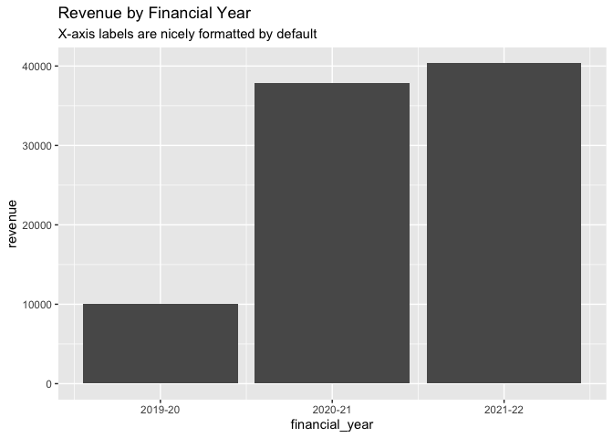

<!-- README.md is generated from README.Rmd. Please edit that file -->

# acadyr

<!-- badges: start -->
<!-- badges: end -->

acadyr provides utility functions for creating and working with
financial and academic years in R:

``` r
library(acadyr)
library(dplyr, warn.conflicts = FALSE)
library(ggplot2)

revenue <- tibble(
  date = seq.Date(as.Date("2020-01-01"), as.Date("2022-01-01"), by = "3 months"),
  financial_year = financial_year(date),
  academic_year = academic_year(date),
  revenue = rnorm(9, 10000, 1000)
)
```

These data types also play nicely with ggplot2:

``` r
revenue |> 
  ggplot(aes(financial_year, revenue)) +
  geom_bar(stat = "summary", fun = "sum") +
  labs(
    title = "Revenue by Financial Year",
    subtitle = "X-axis labels are nicely formatted by default"
  )
```



## Motivation?

Non-calendar year types can cause headaches in everyday analysis for
several reasons:

- They (often) don’t begin on January 1st, meaning they don’t integrate
  easily with other date classes

- Formatting for display is a pain

- Different use cases may require financial/academic years to roll over
  on different times. For example, the UK financial year begins on April
  1st, but the Australian financial year begins on July 1st

## Acknowledgements

- This package is powered by {vctrs}, and its creation was largely
  informed by the (excellent) accompanying documentation
